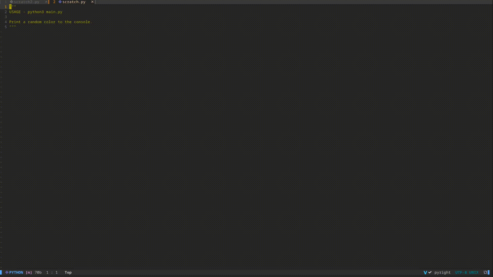
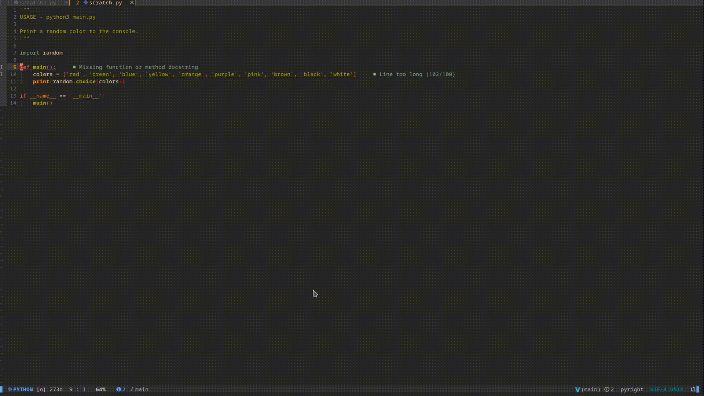
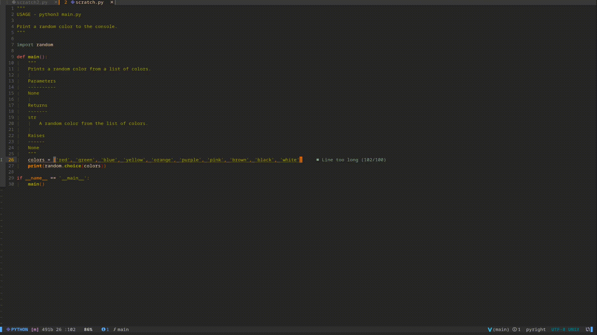

# nvim-magic


[](https://gitlab.com/jameshiew/nvim-magic/-/pipelines)

A pluggable framework for integrating AI code assistance into Neovim. The goals are to make using AI code assistance unobtrusive, and to make it easy to create and share new flows that use AI code assistance. Go to [quickstart](#quickstart) for how to install. It currently works with [OpenAI Codex](https://openai.com/blog/openai-codex/).

## Features

### Completion



### Generating a docstring



### Asking for an alteration



## Quickstart

### Prerequisites

- Neovim (v0.5+)
- `curl`

### Installation

At the moment, only a backend for [OpenAI](https://beta.openai.com/) is implemented, which is bundled in this repo and used by default. Your API key should be made available to your Neovim session in an environment variable `OPENAI_API_KEY`. See [docs/openai.md](docs/openai.md) for more details.

```shell
 export OPENAI_API_KEY='your-api-key-here'
```

Install like any other plugin. It is necessary to call `setup()` once see [docs/config.md](docs/config.md) if you want to override the default configuration e.g. to turn off the default keymaps.

```lua
-- using packer.nvim
use({
	'jameshiew/nvim-magic',
	config = function()
		require('nvim-magic').setup()
	end,
	tag = '0.2.3',  -- recommended to pin to a tag and update manually as there may be breaking changes
	requires = {
		'nvim-lua/plenary.nvim',
		'MunifTanjim/nui.nvim'
	}
})
```

### Keymaps

These flows have keymaps set by default for visual mode selections (though you can disable this by passing `use_default_keymap = false` in the setup config).

You can map your own key sequences to the predefined `<Plug>`s if you don't want to use the default keymaps.

| `<Plug>`                              | default keymap | mode   | action                                     |
| ------------------------------------- | -------------- | ------ | ------------------------------------------ |
| `<Plug>nvim-magic-append-completion`  | `<Leader>mcs`  | visual | Fetch and append completion                |
| `<Plug>nvim-magic-suggest-alteration` | `<Leader>mss`  | visual | Ask for an alteration to the selected text |
| `<Plug>nvim-magic-suggest-docstring`  | `<Leader>mds`  | visual | Generate a docstring                       |
